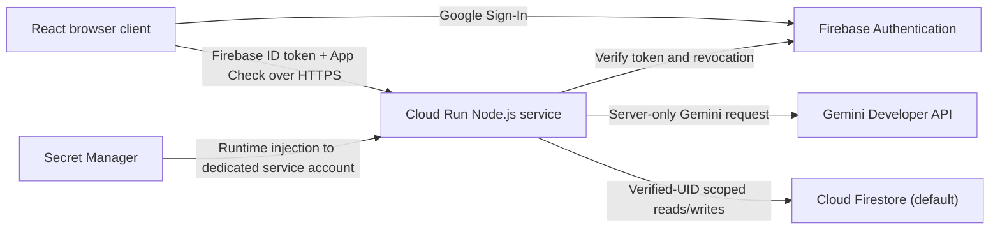

# Secure Personal Gemini Journal

An authenticated, production-minded journal and brainstorming app built for the
Google Cloud Run AI challenge. A user signs in with Google through Firebase,
holds a multi-turn conversation with Gemini, and receives an automatic title
for every saved reflection. The browser never receives the Gemini credential,
and every persisted interaction is scoped to the verified Firebase UID.

## Why this project is different

The project began with a five-zone threat model in Google AI Studio before any
application code was accepted. The baseline uses that threat model as a release
gate, including strict request parsing, revoked-token verification, App Check,
durable idempotency, owner-scoped persistence, bounded model fallback, and safe
text rendering.

The planned original enhancement is **Memory Threads**: opt-in, user-isolated
semantic recall over prior summaries. It is intentionally not mixed into the
baseline until its own AI Studio threat-model gate has passed.

## Architecture



All regional resources use `asia-south1`. Cloud Run scales from zero to one
instance and uses request-based billing.

## Security and cost boundaries

- Google Sign-In only; the app never collects a password.
- Firebase Admin verifies the token signature, issuer, audience, expiry, and
  revocation before a protected request is trusted.
- Firebase App Check is required before every model-backed interaction.
- The backend derives every Firestore path from the verified UID. The browser
  cannot supply an owner UID, history, or turn number.
- Owner-bound Firestore rules protect
  `users/{userId}/interactions/{interactionId}`; all other direct client access
  is denied. The backend independently enforces owner scope because Admin SDK
  access bypasses rules.
- `GEMINI_API_KEY` is injected from one Secret Manager version into the Cloud
  Run service. It is absent from source, browser bundles, responses, and logs.
- Request bodies are limited to 4 KiB. The accepted interaction schema contains
  only `prompt`, `sessionId`, and `idempotencyRequestId`.
- User and model text is rendered as inert text. It never selects tools,
  commands, privileges, database paths, or server-side routing.
- Gemini fallback is fixed to `gemini-3.6-flash`,
  `gemini-3.1-flash-lite`, `gemini-flash-latest`, then
  `gemini-3.7-flash`. Only numeric 503, 429, 404, or 500 advances to the next
  model, and there is no generic retry loop.
- The demo admits one new interaction per verified user per minute, at most 10
  completed interactions globally per UTC calendar month, and at most 80
  charged model attempts. Every chat, fallback, and summary attempt reserves
  capacity before it is issued.
- Search/Maps grounding, media generation, files, caching, code execution,
  GPUs, VPC connectors, PITR, backups, TTL, log exports, Cloud Trace, and paid
  custom metrics are not used.

Expected deployment upfront cost is **₹0** while Cloud Build and Artifact
Registry remain within their free allowances. For the single-user demo, normal
Cloud Run, Firestore, Authentication, App Check, Secret Manager, build, and
storage use is designed to remain in free allowances. The ₹500 project budget
is an alert, not a hard stop; application quotas and the one-instance Cloud Run
ceiling are the operational protection. See [the BOM](docs/bom.md) for unit
pricing and caveats.

## Local verification

Prerequisites: Node.js 22 and an authenticated Google Cloud CLI for deployment.
No real cloud credential is needed by the automated test suite.

```bash
npm ci
npm run typecheck
npm test
npm run build
npm start
```

The test suite covers strict fallback statuses, schema rejection, malformed and
oversized JSON, Auth/App Check rejection, interaction and attempt ceilings,
idempotent retries, accessible quota states, retained drafts, Retry Save, and
inert rendering of untrusted HTML-like text.

## Minimal Google Cloud setup

The deployment uses project `genai-academy-temp` and these Google services:
Cloud Run, Cloud Build, Artifact Registry, Firebase Authentication, Firebase App
Check, Cloud Firestore, Secret Manager, reCAPTCHA Enterprise, and the Gemini
Developer API. The complete reproducible commands and IAM scope are documented
in [the provisioning runbook](docs/provisioning-runbook.md).

The runtime identity is dedicated to this service. It has only App Check token
verification, Firebase Auth viewing, database-scoped Firestore access, and
Secret Accessor on the single named Gemini secret. It has no project Owner or
Editor role.

The intended Cloud Run controls are:

```text
region: asia-south1
CPU / memory: 1 vCPU / 512 MiB
min / max instances: 0 / 1
concurrency: 4
timeout: 15 seconds
required label: dev-tutorial=cloud-run-ai-challenge
```

## Evidence

- [Google AI Studio production directives](docs/ai-studio-production-directives.md)
- [Approved baseline threat model](docs/ai-studio-threat-model.md)
- [Compliance matrix](docs/compliance-matrix.md)
- [Security and functional test plan](docs/security-test-plan.md)
- [Execution log](docs/execution-log.md)

Do not place personal journal text, Firebase ID tokens, App Check tokens,
service-account files, or Gemini keys in issues, screenshots, test reports, or
repository history.
