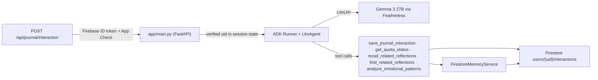

# ADK agent prototype (experimental — not the hackathon submission)

This is a from-scratch rebuild of the Secure Personal Gemini Journal's
backend (`../server.ts`) as an agent using Google's official **Python**
Agent Development Kit (`google-adk`), with real tools and a Firestore-backed
memory service, plus two new capabilities beyond the original design: a
relationship-graph recall tool, and a sentiment/trigger emotional-pattern
graph.

**This branch (`prototype/adk-python-agent`) is a separate exploration, not
the challenge submission.** It does not touch `../src/`, `../server.ts`, the
deployed Cloud Run service, or `../docs/compliance-matrix.md`, and it did not
require reopening the AI Studio threat-model gate that governs the actual
submission — that gate is about this project's own release process, and this
prototype is explicitly outside it. See the parent repository's
[`docs/`](../docs) for that process and the baseline app it governs.

## Why Python, and why not the bare `adk deploy cloud_run` CLI

Google's ADK is Python/Java-first — there is no first-party Node/TypeScript
ADK, only an unofficial, medium-reputation community port. Since "Google's
ADK" was the explicit ask, this is a real Python service, not a JS lookalike.

It's wired as a **custom FastAPI app** (`app/main.py`), not the bare `adk
deploy cloud_run` CLI, because this project's threat model requires Firebase
ID token + App Check verification at the HTTP boundary before the agent ever
runs (`../docs/ai-studio-threat-model.md`, Zone 1/5) — the CLI's default
request handling doesn't know about that.

## Architecture



| Piece | File | Ports / implements |
| --- | --- | --- |
| Chat model | `app/models/featherless_llm.py` | Gemma 3 27B via Featherless's OpenAI-compatible API, through ADK's own `LiteLlm` connector — see "Featherless / Gemma" below |
| Firebase auth | `app/security/firebase_auth.py` | `verifyAuth` (`server.ts:238-257`) |
| App Check | `app/security/app_check.py` | `verifyAppCheck` (`server.ts:259-275`) — see "Corrections" below |
| Journal persistence + quota | `app/tools/journal_tools.py` | the admission transaction (`server.ts:428-506`) + `markCompleted` (`server.ts:349-374`) + `GET /api/journal/quota` (`server.ts:391-409`) |
| Memory Threads recall | `app/memory/firestore_memory_service.py`, `app/tools/recall_tools.py` | `../docs/ai-studio-memory-threads-prompt.md`, implemented as ADK's `BaseMemoryService` over the same Firestore documents — no new database, no paid Agent Engine/Memory Bank dependency |
| Relationship graph tool | `app/tools/graph_tools.py` | new capability beyond the original design — see below |
| Emotional-pattern graph tool | `app/sentiment/`, `app/tools/sentiment_graph_tools.py` | new capability beyond the original design — see below |
| Guardrail callbacks | `app/callbacks/guardrails.py` | App Check re-assertion + monthly capacity reservation before every model attempt (`callWithFallback`, `server.ts:308-323`), now as a single ADK `before_model_callback` rather than a per-fallback-attempt hook — see "Featherless / Gemma" below |
| HTTP entrypoint | `app/main.py` | the four `/api/journal/*` and `/api/config` routes |

## Featherless / Gemma (replaces the Gemini fallback ladder)

The original design's fixed 4-model Gemini fallback ladder
(`FallbackLadderLlm`) has been removed. The agent now uses a single model —
**Gemma 3 27B (`google/gemma-3-27b-it`), served through
[Featherless](https://featherless.ai)'s OpenAI-compatible API** — via ADK's
own `LiteLlm` connector (`app/models/featherless_llm.py`), so no custom
`BaseLlm` subclass is needed for this. Set `FEATHERLESS_API_KEY` to run it
for real (never bundled to a client, same as `GEMINI_API_KEY` was).

Two real things were only found by checking the installed package, not
assumed:
- Importing `google.adk.models.lite_llm.LiteLlm` raises `ImportError`
  unless installed as `google-adk[extensions]` — a non-obvious extra,
  reflected in `pyproject.toml`.
- With no fallback ladder, the per-attempt App Check/capacity guardrail
  (previously injected into `FallbackLadderLlm`'s call loop) is now ADK's
  own `before_model_callback` on the `LlmAgent` — verified directly against
  `base_llm_flow.py`'s source that the callback is awaited with no
  surrounding try/except, so raising `CapacityExhaustedError` from it
  propagates cleanly out through `runner.run_async`, exactly like the
  exhausted-ladder case did before. The summary+sentiment extraction call
  bypasses the Runner entirely, so it asserts the same guardrail directly
  (`reserve_model_attempt`/`assert_current_app_check`, both shared with the
  callback) rather than getting it automatically.

Multi-turn history growth is bounded by ADK's own `ContextFilterPlugin`
(`app/main.py::_run_agent_turn`, `HISTORY_INVOCATIONS_TO_KEEP` in
`app/config.py`) rather than a hand-rolled token-budget trim — verified to
exist in the installed package and to preserve function-call/response
pairing when it trims. ADK's `LlmAgent` has no partial token-budget history
primitive (only `include_contents: "default"|"none"`, checked directly), so
a turn-count bound is what's actually available, not a compromise chosen
over a token-based one.

### Token caps, revised for a 32k-context model

`CHAT_INPUT_TOKEN_CAP`/`CHAT_OUTPUT_TOKEN_CAP` were sized for Gemini's
free-tier cost profile (1,000/300, and the output cap was defined but never
actually wired to a request — a real bug, not a deliberate choice). Against
Gemma 3 27B's 32,768-token window they're now 7,000/2,000: generous
per-message caps, not the whole budget, and the output cap is now genuinely
enforced via `generate_content_config` on the `LlmAgent`. See the
conversation history in this session for the full context-window walkthrough
(what fills a turn 1 request, how it grows with tool-call traffic across
turns) that these numbers were sized against.

## The graph tool ("Obsidian/graphify"-style)

`find_related_reflections` builds a small `networkx` graph **in memory, per
request, scoped to the calling user's own interactions only**: edges come
from embedding similarity (reusing the same embeddings already computed for
Memory Threads recall — no extra model cost) and cheap shared-keyword
overlap. It then does a bounded BFS (depth ≤ 2) from the entries most similar
to the query, so a reflection can surface as related even when it isn't
directly similar to the query itself — connected instead through an
intermediate entry, the way Obsidian's graph view surfaces linked notes. No
new paid graph database; no raw vector is ever returned.
`tests/test_graph_tool.py` proves the depth-1-vs-depth-2 distinction with a
hand-constructed fixture where this actually changes the result.

## The emotional-pattern graph ("which thing made me feel what")

Distinct from the relationship graph above: `analyze_emotional_patterns`
answers a personal-journaling-specific question — what tends to cause which
feeling, aggregated across a user's own history.

- **Extraction** (`app/sentiment/extraction.py`) is folded into the existing
  post-hoc title-generation call, not a separate model call: one JSON
  response now carries `title`, `emotions` (fixed taxonomy + 0-1 intensity,
  `EMOTION_TAXONOMY` in `app/config.py`), and `triggers` (open-ended label +
  free-text phrase + intensity). The title stays a hard requirement exactly
  as before (a missing title still fails the save, per SAVE-06); a malformed
  emotions/triggers portion degrades to `sentimentStatus: "failed"` instead,
  so a sentiment-parsing hiccup can never regress the existing save
  guarantee — the same pattern `FirestoreMemoryService`'s embedding-failure
  handling already uses.
- **Trigger-label canonicalization** (`app/sentiment/vocabulary.py`) is two
  layers, per the user's explicit requirement that near-duplicate labels
  must not fork the graph: (1) the model is shown the user's existing
  trigger vocabulary — derived fresh from stored data each time, no separate
  vocabulary document — and instructed to reuse a fitting label; (2) a
  code-side `difflib`-based token-overlap safety net snaps obvious
  surface-level variants (word reordering, plurals: "stress at work" →
  "work stress", "sleeping" → "sleep") without a second model call. This
  safety net deliberately does **not** catch true synonyms with no shared
  words (e.g. "job pressure" vs "work stress") — that's the model's job,
  given the vocabulary in its prompt; `tests/test_sentiment_extraction.py`
  documents this boundary explicitly rather than overclaiming it.
- **The graph itself** (`app/tools/sentiment_graph_tools.py`) aggregates
  every stored `Trigger`→`Emotion` co-occurrence into a weighted
  `networkx` graph, in memory, per request, per user. A pattern is only
  reported once it has at least `MIN_MENTIONS_FOR_INSIGHT` occurrences, so
  one journal entry never reads as a settled trend.
  `tests/test_sentiment_graph_tool.py` proves the aggregation counts/
  averages and the min-mentions filtering on a synthetic multi-entry
  fixture.

## A deliberate deviation from server.ts, stated explicitly

`save_journal_interaction` is a real tool the agent can call as part of its
own turn — genuine agentic tool use. But this project treats "never silently
lose a submitted input" as non-negotiable (compliance matrix C-16), so
persistence cannot be contingent on the model choosing to call a tool.
`app/main.py` therefore **also** deterministically calls the same underlying
`persist_completed_interaction` function itself after every turn, regardless
of what the agent did — the idempotency key makes this safe (whichever write
lands first wins; the other is a no-op duplicate return). The tool call is
for genuine agentic visibility, not the correctness guarantee.

## Corrections made during implementation (verify against real sources, not just docs)

The initial plan flagged the Python Firebase Admin SDK's App Check support
as a likely gap, based on documentation search that only surfaced
`app_check.token()` (mint a token for testing). Checked directly against the
**actually-installed** `firebase-admin` package (7.5.0) instead of trusting
that search: `firebase_admin.app_check.verify_token()` exists and is a real
verifier. `app/security/app_check.py` wraps that directly — no hand-rolled
JWT/JWKS code was needed after all. Every other structural assumption in the
plan (`BaseLlm`/`Gemini`/`LlmRequest`/`LlmResponse` field names, `LlmAgent`
construction, `Runner`/session flow, `BaseMemoryService`'s real method
signatures and `MemoryEntry` shape) was likewise verified by constructing
real instances against the installed `google-adk` 2.8.0 in this session, not
assumed from training data or docs search alone.

## What is and isn't verified

**Actually run in this session**, against the real installed packages
(`google-adk[extensions]` 2.8.0, `firebase-admin` 7.5.0), not just written
and assumed:
- `build_gemma_model()` constructs a real `LiteLlm` pointed at Featherless;
  `LlmAgent` construction with it, `generate_content_config`, and
  `before_model_callback` all build successfully against the real ADK.
- The full `Runner` (with `ContextFilterPlugin`) → `Session` → agent →
  `before_model_callback` → final-response flow was exercised end-to-end
  with a stub model: the callback fires, capacity is reserved, and the
  expected final text comes back.
- `reserve_model_attempt`/`assert_current_app_check`/`build_before_model_
  callback` are unit-tested directly (`tests/test_guardrails.py`) — this
  caught a real, pre-existing gap: the original per-attempt guardrail
  (and this one, initially) called Firestore's real `@transactional`
  decorator directly, which a lightweight fake transaction can't satisfy
  (it drives actual GAPIC begin/commit/retry internals). Fixed with the
  same injectable-wrapper escape hatch `persist_completed_interaction`
  already used, not previously applied here.
- `FirestoreMemoryService`, the journal admission/idempotency/capacity
  transaction logic, and the sentiment extraction/canonicalization/graph
  aggregation logic are unit-tested against an in-memory Firestore fake
  (`tests/fakes.py`) — `54 passed` via `pytest` at the time of writing.
- The similarity thresholds in `app/sentiment/vocabulary.py` were tuned
  against concrete verified label pairs (not guessed): 0.75 catches
  word-reordering and plural/tense variants while keeping distinct concepts
  like "work" and "workout" apart.
- `app/main.py`'s HTTP layer (auth/App Check/validation ordering, the
  `{"error": ...}` response contract) is smoke-tested with `TestClient` —
  this also caught a real bug: `build_root_agent(deps)` (which now raises
  immediately if `FEATHERLESS_API_KEY` is missing) originally sat outside
  the `try/except` around the chat call, so a missing key surfaced as an
  uncaught 500 instead of the intended safe 503.

**Not exercised — needs a real Featherless API key and Firebase project to
verify**, and was not run with either in this session:
- An actual Gemma completion succeeding through Featherless's API.
- Whether a real model reliably returns the exact combined title/emotions/
  triggers JSON shape `app/sentiment/extraction.py` expects, and whether it
  actually reuses vocabulary labels shown in its prompt as instructed —
  the parsing/canonicalization logic is verified against synthetic
  responses, not a live model's actual output.
- The App Check verifier against a real App Check token.
- The `GeminiEmbeddingClient` adapter's exact `google-genai` call shape
  (`app/models/embedding_client.py` — isolated to one file specifically so a
  correction, if needed, stays contained; embeddings are unaffected by the
  Featherless switch and still use `GEMINI_API_KEY`).
- A real Cloud Run deployment (the `Dockerfile` is documented, not built or
  deployed).

## Running it

```bash
cd adk-agent
python3 -m venv .venv && source .venv/bin/activate
pip install -e ".[dev]"
pytest
```

No real Gemini/Firebase credentials are used anywhere in the test suite,
per `../docs/security-test-plan.md`'s "no real credential in tests" rule,
ported to this prototype.

To actually run the service against real credentials (not exercised here):

```bash
export FEATHERLESS_API_KEY=...   # chat model — server-side only, never bundled to a client
export GEMINI_API_KEY=...        # still used for Memory Threads embeddings only
export GOOGLE_APPLICATION_CREDENTIALS=...  # or run inside a GCP environment with ADC
python -m app.main
```
