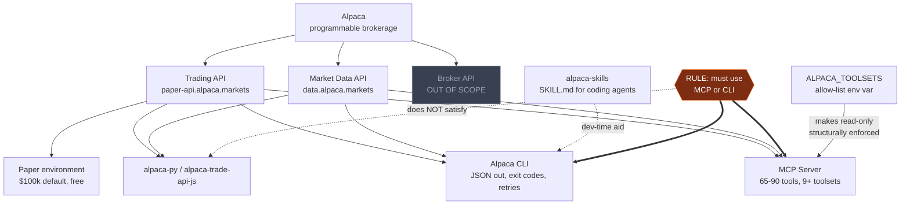
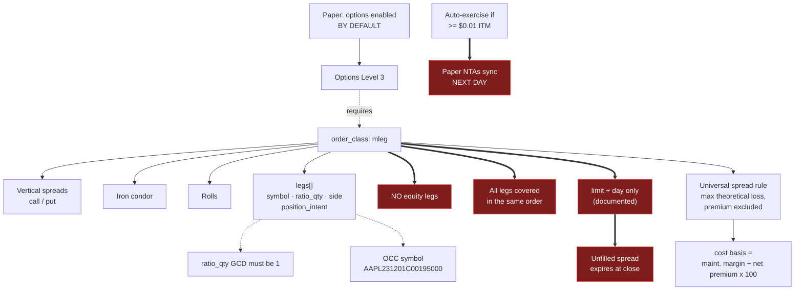
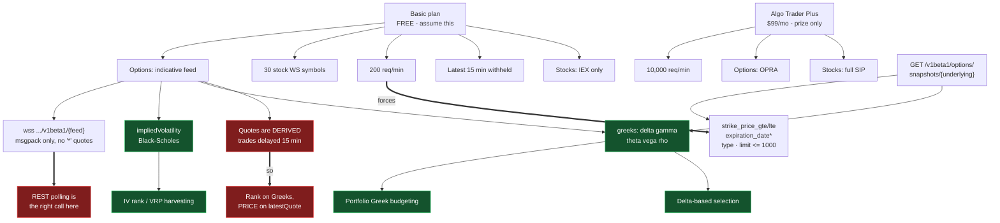
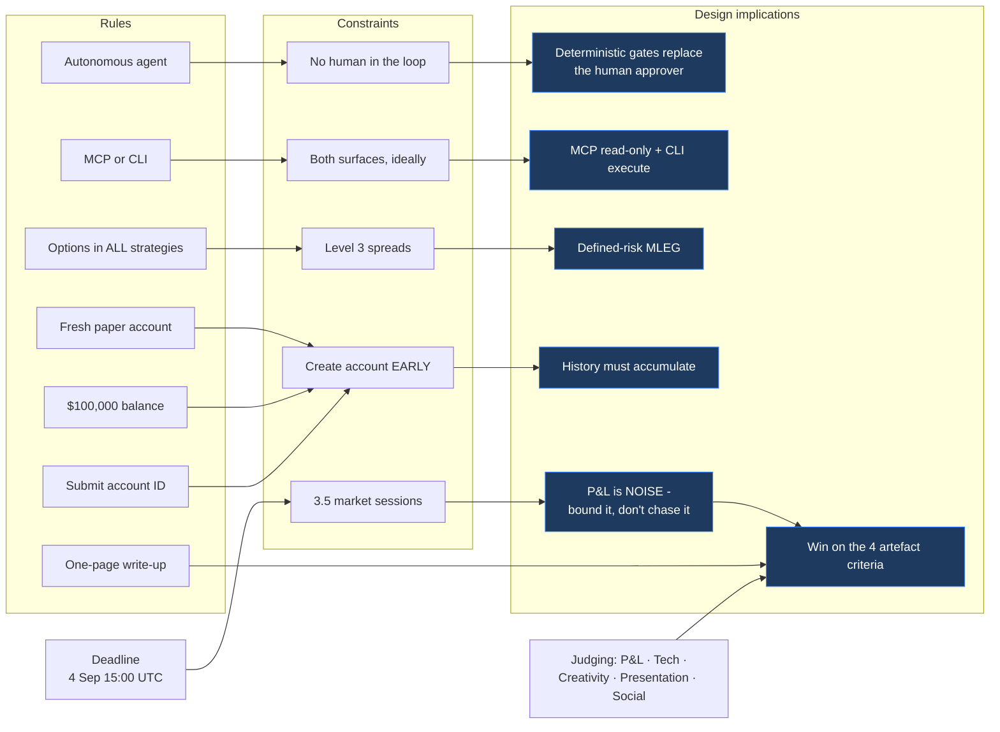
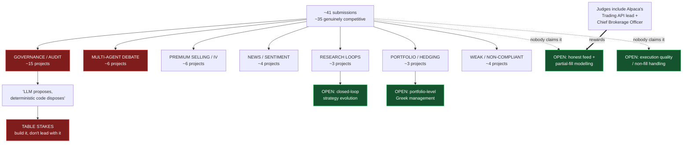

# Knowledge Graph

Five views over the same entity set. The machine-readable form is `graph.json` — every node here
appears there with typed edges, facts and source URLs.

**Edge legend:** solid `-->` provides/enables · dashed `-.->` requires/depends · thick `==>` blocks
or constrains.

---

## View 1 · Platform & agent surfaces

---

## View 2 · Options execution path and its prerequisites

---

## View 3 · Data tiers — what is actually available for free

---

## View 4 · Hackathon rules → constraints → design implications

---

## View 5 · Competitive pattern map

---

## How to use this graph

- **Designing a strategy?** Start at View 3 — it tells you what data you actually have.
- **Designing execution?** View 2 — it tells you what orders you can actually place.
- **Choosing a differentiator?** View 5 — it tells you what is already taken.
- **Checking eligibility?** View 4 — every rule traced to its consequence.
- **Programmatic use?** Load `graph.json`; each node carries `facts[]` and `source_urls[]`.
